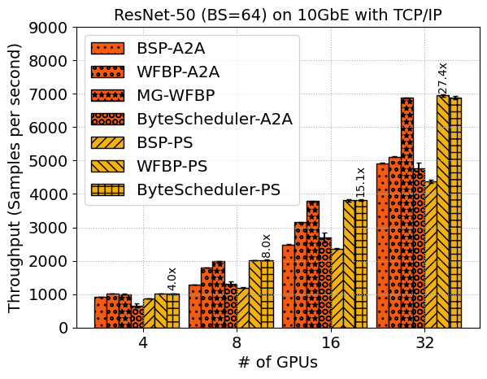
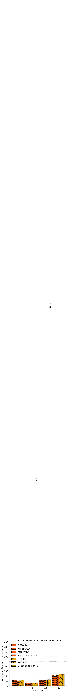
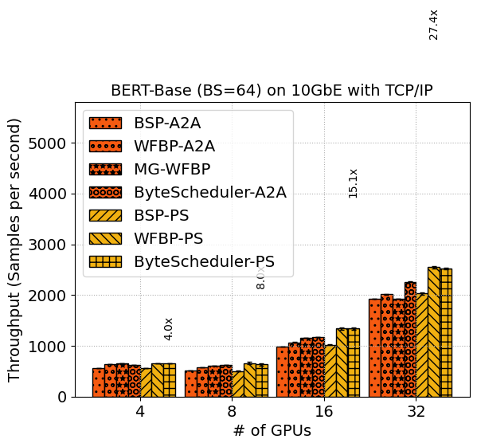
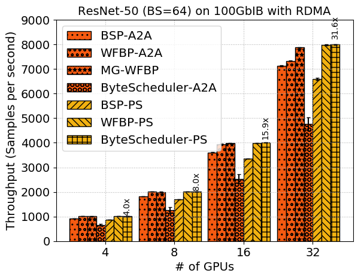
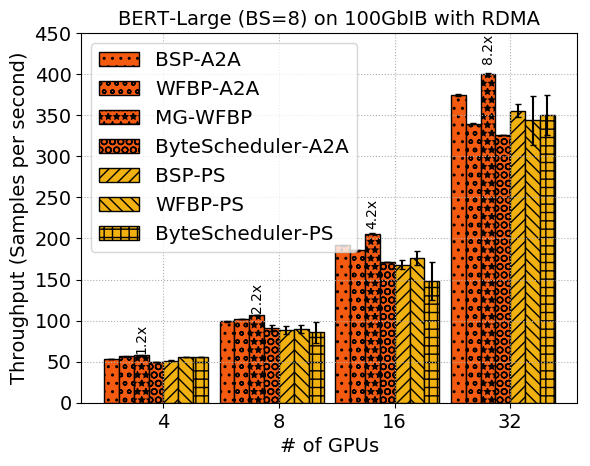
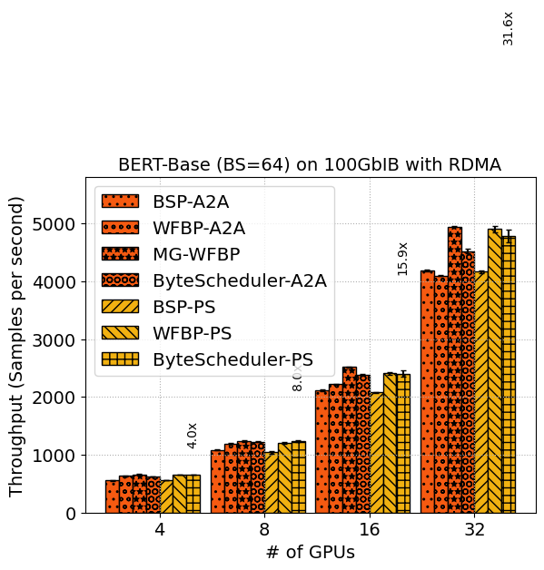
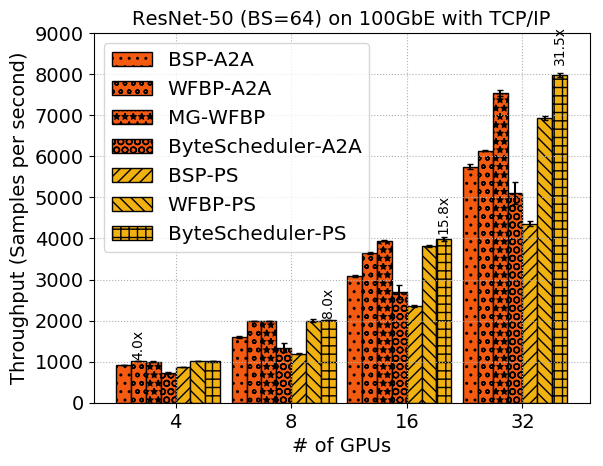
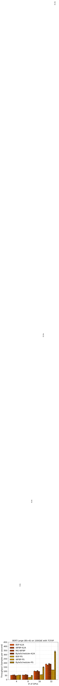
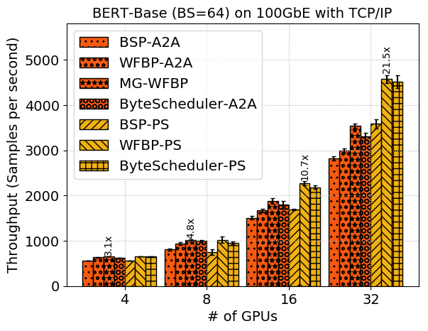

# Results generated on 2020-05-29

|  DNN | BS | CONNECTION | METHOD | Baseline | 1 GPU | 4 GPUs | 8 GPUs | 16 GPUs | 32 GPUs |
|-------------- | -------------- | -------------- | -------------- | -------------- | -------------- | -------------- | -------------- | -------------- | -------------- | 
| ResNet-50 | 64 | 10GbE with TCP/IP | BSP-A2A | 253.1 | 925.020 +- 4.42 | 1282.280 +- 1.94 | 2485.120 +- 4.27 | 4920.820 +- 4.43 | 
| ResNet-50 | 64 | 10GbE with TCP/IP | WFBP-A2A | 253.1 | 1015.400 +- 1.26 | 1795.740 +- 2.67 | 3146.780 +- 4.72 | 5113.180 +- 14.01 | 
| ResNet-50 | 64 | 10GbE with TCP/IP | MG-WFBP | 253.1 | 1003.180 +- 2.42 | 1980.580 +- 3.20 | 3784.980 +- 7.18 | 6883.600 +- 12.72 | 
| ResNet-50 | 64 | 10GbE with TCP/IP | ByteScheduler-A2A | 253.1 | 658.120 +- 64.81 | 1319.100 +- 56.35 | 2701.520 +- 140.42 | 4754.260 +- 189.83 | 
| ResNet-50 | 64 | 10GbE with TCP/IP | BSP-PS | 253.1 | 866.300 +- 1.29 | 1194.440 +- 8.54 | 2361.270 +- 17.57 | 4376.578 +- 56.81 | 
| ResNet-50 | 64 | 10GbE with TCP/IP | WFBP-PS | 253.1 | 1017.320 +- 0.98 | 2021.440 +- 5.01 | 3811.965 +- 32.44 | 6945.390 +- 48.35 | 
| ResNet-50 | 64 | 10GbE with TCP/IP | ByteScheduler-PS | 253.1 | 1018.400 +- 3.18 | 2025.620 +- 5.36 | 3815.625 +- 22.22 | 6888.995 +- 50.17 | 
| BERT-Large | 8 | 10GbE with TCP/IP | BSP-A2A | 49 | 53.040 +- 0.12 | 28.960 +- 0.08 | 54.300 +- 0.06 | 105.100 +- 0.23 | 
| BERT-Large | 8 | 10GbE with TCP/IP | WFBP-A2A | 49 | 56.040 +- 0.08 | 29.060 +- 0.05 | 53.420 +- 0.07 | 101.960 +- 0.10 | 
| BERT-Large | 8 | 10GbE with TCP/IP | MG-WFBP | 49 | 57.340 +- 0.30 | 30.040 +- 0.05 | 54.260 +- 0.10 | 105.020 +- 0.21 | 
| BERT-Large | 8 | 10GbE with TCP/IP | ByteScheduler-A2A | 49 | 51.320 +- 0.40 | 30.400 +- 0.00 | 56.000 +- 0.00 | 108.800 +- 0.00 | 
| BERT-Large | 8 | 10GbE with TCP/IP | BSP-PS | 49 | 51.420 +- 0.29 | 28.367 +- 0.21 | 59.220 +- 0.55 | 117.957 +- 0.45 | 
| BERT-Large | 8 | 10GbE with TCP/IP | WFBP-PS | 49 | 55.420 +- 0.07 | 29.800 +- 0.17 | 61.315 +- 0.31 | 118.360 +- 1.04 | 
| BERT-Large | 8 | 10GbE with TCP/IP | ByteScheduler-PS | 49 | 55.340 +- 0.14 | 29.310 +- 0.12 | 61.210 +- 1.00 | 116.790 +- 0.80 | 
| BERT-Base | 64 | 10GbE with TCP/IP | BSP-A2A | 212.8 | 555.520 +- 2.22 | 518.940 +- 0.55 | 984.880 +- 1.17 | 1926.640 +- 4.08 | 
| BERT-Base | 64 | 10GbE with TCP/IP | WFBP-A2A | 212.8 | 634.100 +- 0.88 | 582.260 +- 1.63 | 1069.480 +- 1.87 | 2013.380 +- 1.34 | 
| BERT-Base | 64 | 10GbE with TCP/IP | MG-WFBP | 212.8 | 659.060 +- 1.11 | 611.440 +- 1.70 | 1153.180 +- 0.85 | 1925.780 +- 4.03 | 
| BERT-Base | 64 | 10GbE with TCP/IP | ByteScheduler-A2A | 212.8 | 623.380 +- 1.12 | 624.000 +- 0.00 | 1177.400 +- 2.37 | 2259.840 +- 10.59 | 
| BERT-Base | 64 | 10GbE with TCP/IP | BSP-PS | 212.8 | 559.260 +- 1.87 | 505.438 +- 2.93 | 1022.375 +- 10.63 | 2028.020 +- 18.44 | 
| BERT-Base | 64 | 10GbE with TCP/IP | WFBP-PS | 212.8 | 653.500 +- 0.94 | 657.380 +- 23.13 | 1341.115 +- 26.96 | 2546.695 +- 21.35 | 
| BERT-Base | 64 | 10GbE with TCP/IP | ByteScheduler-PS | 212.8 | 652.580 +- 0.69 | 634.720 +- 24.66 | 1343.490 +- 23.15 | 2523.845 +- 16.45 | 
| ResNet-50 | 64 | 100GbIB with RDMA | BSP-A2A | 253.1 | 920.280 +- 2.68 | 1821.200 +- 4.28 | 3602.900 +- 7.03 | 7126.520 +- 15.78 | 
| ResNet-50 | 64 | 100GbIB with RDMA | WFBP-A2A | 253.1 | 1014.280 +- 1.13 | 2017.120 +- 3.96 | 3946.060 +- 11.07 | 7326.560 +- 12.13 | 
| ResNet-50 | 64 | 100GbIB with RDMA | MG-WFBP | 253.1 | 1003.900 +- 1.07 | 2001.720 +- 3.97 | 3987.400 +- 6.04 | 7876.460 +- 14.15 | 
| ResNet-50 | 64 | 100GbIB with RDMA | ByteScheduler-A2A | 253.1 | 653.800 +- 36.46 | 1257.660 +- 116.47 | 2529.140 +- 183.69 | 4766.380 +- 273.59 | 
| ResNet-50 | 64 | 100GbIB with RDMA | BSP-PS | 253.1 | 862.960 +- 0.55 | 1694.900 +- 3.05 | 3353.225 +- 4.81 | 6587.627 +- 51.39 | 
| ResNet-50 | 64 | 100GbIB with RDMA | WFBP-PS | 253.1 | 1010.800 +- 1.83 | 2008.088 +- 3.21 | 3988.670 +- 5.04 | 7977.785 +- 30.28 | 
| ResNet-50 | 64 | 100GbIB with RDMA | ByteScheduler-PS | 253.1 | 1015.820 +- 1.05 | 2018.390 +- 1.93 | 4013.880 +- 6.84 | 7999.830 +- 15.85 | 
| BERT-Large | 8 | 100GbIB with RDMA | BSP-A2A | 49 | 53.080 +- 0.07 | 99.180 +- 0.58 | 191.640 +- 0.85 | 375.220 +- 1.19 | 
| BERT-Large | 8 | 100GbIB with RDMA | WFBP-A2A | 49 | 56.300 +- 0.22 | 101.680 +- 0.17 | 185.420 +- 0.47 | 339.820 +- 0.89 | 
| BERT-Large | 8 | 100GbIB with RDMA | MG-WFBP | 49 | 57.500 +- 0.23 | 106.780 +- 0.32 | 205.780 +- 0.77 | 400.160 +- 1.88 | 
| BERT-Large | 8 | 100GbIB with RDMA | ByteScheduler-A2A | 49 | 49.420 +- 0.25 | 91.267 +- 3.49 | 171.900 +- 0.00 | 326.400 +- 0.00 | 
| BERT-Large | 8 | 100GbIB with RDMA | BSP-PS | 49 | 51.380 +- 0.26 | 88.510 +- 4.50 | 168.215 +- 5.56 | 355.690 +- 8.37 | 
| BERT-Large | 8 | 100GbIB with RDMA | WFBP-PS | 49 | 55.300 +- 0.15 | 89.890 +- 4.69 | 175.735 +- 8.51 | 344.022 +- 29.90 | 
| BERT-Large | 8 | 100GbIB with RDMA | ByteScheduler-PS | 49 | 55.360 +- 0.10 | 85.520 +- 12.64 | 148.090 +- 22.82 | 349.933 +- 24.25 | 
| BERT-Base | 64 | 100GbIB with RDMA | BSP-A2A | 212.8 | 555.700 +- 3.68 | 1082.420 +- 3.89 | 2112.960 +- 13.72 | 4184.380 +- 16.23 | 
| BERT-Base | 64 | 100GbIB with RDMA | WFBP-A2A | 212.8 | 631.800 +- 3.78 | 1195.680 +- 2.29 | 2217.220 +- 6.20 | 4098.680 +- 4.94 | 
| BERT-Base | 64 | 100GbIB with RDMA | MG-WFBP | 212.8 | 660.420 +- 2.29 | 1235.040 +- 8.64 | 2515.300 +- 10.77 | 4940.080 +- 6.85 | 
| BERT-Base | 64 | 100GbIB with RDMA | ByteScheduler-A2A | 212.8 | 621.200 +- 2.91 | 1223.260 +- 4.58 | 2379.575 +- 19.48 | 4521.260 +- 39.68 | 
| BERT-Base | 64 | 100GbIB with RDMA | BSP-PS | 212.8 | 557.920 +- 0.74 | 1040.010 +- 23.68 | 2077.680 +- 12.70 | 4162.205 +- 19.55 | 
| BERT-Base | 64 | 100GbIB with RDMA | WFBP-PS | 212.8 | 652.780 +- 0.55 | 1203.500 +- 15.41 | 2409.280 +- 23.10 | 4899.632 +- 53.75 | 
| BERT-Base | 64 | 100GbIB with RDMA | ByteScheduler-PS | 212.8 | 651.740 +- 1.06 | 1239.580 +- 18.47 | 2403.040 +- 56.11 | 4783.965 +- 106.85 | 
| ResNet-50 | 64 | 100GbE with TCP/IP | BSP-A2A | 253.1 | 926.000 +- 4.03 | 1601.360 +- 24.00 | 3087.160 +- 16.60 | 5744.760 +- 62.88 | 
| ResNet-50 | 64 | 100GbE with TCP/IP | WFBP-A2A | 253.1 | 1015.100 +- 1.56 | 1985.740 +- 2.59 | 3650.740 +- 19.21 | 6141.380 +- 21.40 | 
| ResNet-50 | 64 | 100GbE with TCP/IP | MG-WFBP | 253.1 | 1002.680 +- 1.38 | 1990.680 +- 2.90 | 3945.960 +- 8.87 | 7540.940 +- 64.88 | 
| ResNet-50 | 64 | 100GbE with TCP/IP | ByteScheduler-A2A | 253.1 | 728.520 +- 31.66 | 1344.300 +- 117.34 | 2687.680 +- 168.51 | 5104.060 +- 272.81 | 
| ResNet-50 | 64 | 100GbE with TCP/IP | BSP-PS | 253.1 | 864.140 +- 0.36 | 1191.650 +- 9.31 | 2353.150 +- 26.56 | 4355.977 +- 58.99 | 
| ResNet-50 | 64 | 100GbE with TCP/IP | WFBP-PS | 253.1 | 1014.780 +- 0.47 | 2002.060 +- 29.46 | 3811.350 +- 30.02 | 6933.738 +- 41.83 | 
| ResNet-50 | 64 | 100GbE with TCP/IP | ByteScheduler-PS | 253.1 | 1015.060 +- 1.51 | 2017.660 +- 2.97 | 3996.030 +- 49.68 | 7982.248 +- 42.88 | 
| BERT-Large | 8 | 100GbE with TCP/IP | BSP-A2A | 49 | 52.900 +- 0.25 | 55.800 +- 2.14 | 103.340 +- 3.16 | 187.000 +- 2.42 | 
| BERT-Large | 8 | 100GbE with TCP/IP | WFBP-A2A | 49 | 56.000 +- 0.43 | 54.820 +- 2.29 | 98.980 +- 2.23 | 174.780 +- 4.21 | 
| BERT-Large | 8 | 100GbE with TCP/IP | MG-WFBP | 49 | 57.540 +- 0.21 | 62.020 +- 1.08 | 107.480 +- 4.46 | 191.460 +- 6.33 | 
| BERT-Large | 8 | 100GbE with TCP/IP | ByteScheduler-A2A | 49 | 48.900 +- 0.60 | 56.025 +- 3.33 | 99.500 +- 0.60 | 187.560 +- 1.81 | 
| BERT-Large | 8 | 100GbE with TCP/IP | BSP-PS | 49 | 51.460 +- 0.14 | 27.860 +- 0.37 | 59.185 +- 0.31 | 117.853 +- 0.95 | 
| BERT-Large | 8 | 100GbE with TCP/IP | WFBP-PS | 49 | 55.320 +- 0.17 | 29.610 +- 0.20 | 61.605 +- 0.61 | 116.725 +- 1.48 | 
| BERT-Large | 8 | 100GbE with TCP/IP | ByteScheduler-PS | 49 | 55.400 +- 0.09 | 50.200 +- 2.84 | 151.535 +- 7.46 | 338.123 +- 12.58 | 
| BERT-Base | 64 | 100GbE with TCP/IP | BSP-A2A | 212.8 | 555.360 +- 2.30 | 804.620 +- 21.06 | 1504.620 +- 38.19 | 2815.720 +- 47.12 | 
| BERT-Base | 64 | 100GbE with TCP/IP | WFBP-A2A | 212.8 | 632.580 +- 4.57 | 933.200 +- 29.08 | 1671.620 +- 40.80 | 2987.480 +- 46.72 | 
| BERT-Base | 64 | 100GbE with TCP/IP | MG-WFBP | 212.8 | 658.420 +- 4.08 | 1021.400 +- 9.85 | 1880.280 +- 59.19 | 3540.800 +- 52.34 | 
| BERT-Base | 64 | 100GbE with TCP/IP | ByteScheduler-A2A | 212.8 | 620.600 +- 2.32 | 992.350 +- 28.03 | 1792.620 +- 90.12 | 3303.750 +- 77.65 | 
| BERT-Base | 64 | 100GbE with TCP/IP | BSP-PS | 212.8 | 557.180 +- 0.84 | 748.780 +- 66.49 | 1688.950 +- 21.63 | 3583.770 +- 102.18 | 
| BERT-Base | 64 | 100GbE with TCP/IP | WFBP-PS | 212.8 | 652.460 +- 0.64 | 1020.580 +- 71.00 | 2271.995 +- 51.50 | 4575.775 +- 85.56 | 
| BERT-Base | 64 | 100GbE with TCP/IP | ByteScheduler-PS | 212.8 | 652.800 +- 0.47 | 956.310 +- 32.14 | 2181.550 +- 35.41 | 4516.998 +- 140.77 | 

# Figures

